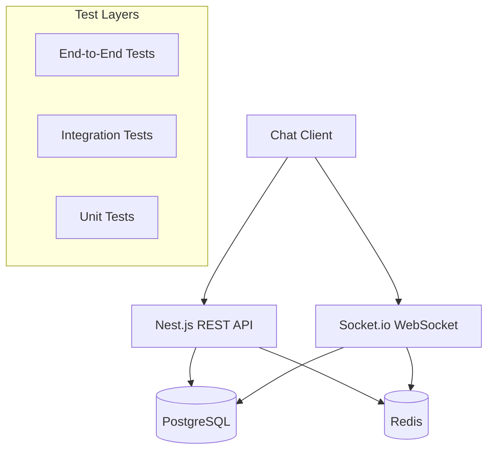

# Design Document

## Overview

This design implements a test-first chat MVP backend following the Blue → Red → Green methodology. The system prioritizes user-visible outcomes over infrastructure complexity, building only what tests demand. The architecture uses Nest.js as the application framework with PostgreSQL for persistence, Redis for caching/sessions, and Socket.io for real-time communication.

The core principle is: "Never build infrastructure before a test fails because it's missing." Each component follows a strict testing cycle where skeleton tests pass first (Blue), then fail with real expectations (Red), then pass with minimal implementation (Green).

## Architecture

### High-Level Architecture



### Testing Architecture (Blue → Red → Green)

```mermaid
graph LR
    Blue[Blue Phase<br/>Skeleton Tests<br/>expect(true)] --> Red[Red Phase<br/>Real Expectations<br/>Test Fails]
    Red --> Green[Green Phase<br/>Minimal Code<br/>Test Passes]
    Green --> Refactor[Refactor<br/>Clean Code<br/>All Tests Pass]
    Refactor --> Blue2[Next Feature<br/>Blue Phase]
```

### Infrastructure Setup Sequence

1. **Nest.js Application** - Basic HTTP server with health endpoint
2. **PostgreSQL Connection** - Database connectivity with SELECT 1 validation
3. **Redis Connection** - Cache connectivity with PING/PONG validation  
4. **Socket.io Integration** - WebSocket server with connection handling
5. **End-to-End Smoke Test** - Complete message flow validation

## Components and Interfaces

### 1. Test Structure

```typescript
// Core test categories following user actions
interface UserOutcomeTests {
  user_sees_chat_list(): boolean;
  user_opens_chat_shows_history(): boolean;
  user_sends_message_shows_locally(): boolean;
  message_persists_across_sessions(): boolean;
  recipient_receives_in_real_time(): boolean;
  read_receipts_update_correctly(): boolean;
}

// Infrastructure validation tests
interface InfrastructureTests {
  nest_app_boots(): boolean;
  postgres_connection_works(): boolean;
  redis_ping_pong(): boolean;
  socket_client_connects(): boolean;
  end_to_end_message_flow(): boolean;
}
```

### 2. Chat Service Interface

```typescript
interface ChatService {
  // Phase 1: Hardcoded responses
  getChatList(userId: string): Promise<ChatPreview[]>;
  getChatHistory(chatId: string): Promise<Message[]>;
  sendMessage(message: CreateMessageDto): Promise<MessageResponse>;
  
  // Phase 2: Database integration (only when persistence test fails)
  // Phase 3: Real-time integration (only when real-time test fails)
}

interface ChatPreview {
  id: string;
  participantUuid: string;  // UUID only - names come from kaha-main-v3
  lastMessage: string;
  timestamp: Date;
  unreadCount: number;
}

interface Message {
  id: string;
  chatId: string;
  senderUuid: string;  // UUID only - names come from kaha-main-v3
  content: string;
  timestamp: Date;
  readBy: string[];  // Array of user UUIDs
}
```

### 3. Socket.io Event Interface

```typescript
interface SocketEvents {
  // Client to Server
  'join-chat': (chatId: string) => void;
  'send-message': (message: CreateMessageDto) => void;
  'mark-read': (messageIds: string[]) => void;
  
  // Server to Client  
  'message-received': (message: Message) => void;
  'message-read': (messageId: string, readBy: string) => void;
  'user-typing': (userId: string, chatId: string) => void;
}
```

## Data Models

### Database Schema (PostgreSQL)

```sql
-- Only created when "message disappears after restart" test fails
-- IMPORTANT: We store UUIDs only, never names/avatars (those come from kaha-main-v3)

CREATE TABLE chats (
  id UUID PRIMARY KEY DEFAULT gen_random_uuid(),
  created_at TIMESTAMP DEFAULT NOW(),
  updated_at TIMESTAMP DEFAULT NOW()
);

CREATE TABLE chat_participants (
  chat_id UUID REFERENCES chats(id),
  user_uuid UUID NOT NULL,  -- UUID only, no names stored
  joined_at TIMESTAMP DEFAULT NOW(),
  PRIMARY KEY (chat_id, user_uuid)
);

CREATE TABLE messages (
  id UUID PRIMARY KEY DEFAULT gen_random_uuid(),
  chat_id UUID REFERENCES chats(id),
  sender_uuid UUID NOT NULL,  -- UUID only, no names stored
  content TEXT NOT NULL,
  created_at TIMESTAMP DEFAULT NOW()
);

CREATE TABLE message_reads (
  message_id UUID REFERENCES messages(id),
  user_uuid UUID NOT NULL,  -- UUID only, no names stored
  read_at TIMESTAMP DEFAULT NOW(),
  PRIMARY KEY (message_id, user_uuid)
);
```

### Redis Schema (Session/Cache)

```typescript
// Only implemented when "chat list loads slowly" test fails
interface RedisSchema {
  // Chat list cache
  `chat_list:${userUuid}`: ChatPreview[];
  
  // User profile cache (from kaha-main-v3)
  `profile:${userUuid}`: { name: string; avatar?: string; };
  
  // Online users
  `online_users`: Set<string>;  // Set of user UUIDs
  
  // Socket session mapping
  `socket:${socketId}`: { userUuid: string; chatId?: string };
}
```

## Error Handling

### Test-Driven Error Strategy

1. **Blue Phase**: All error scenarios return success
2. **Red Phase**: Introduce real error conditions that cause test failures
3. **Green Phase**: Implement minimal error handling to pass tests

### Error Categories

```typescript
interface ErrorHandling {
  // Network errors (Socket.io disconnection)
  handleConnectionLoss(): void;
  
  // Database errors (PostgreSQL connection issues)
  handleDatabaseError(error: DatabaseError): ErrorResponse;
  
  // Validation errors (Invalid message content)
  handleValidationError(error: ValidationError): ErrorResponse;
  
  // Business logic errors (User not in chat)
  handleBusinessError(error: BusinessError): ErrorResponse;
}
```

## Testing Strategy

### Phase 0: Blue Tests (All Pass)

Create skeleton tests that validate structure without real logic:

```typescript
describe('Chat MVP - Blue Phase', () => {
  it('user sees chat list', () => {
    expect(true).toBe(true); // Skeleton passes
  });
  
  it('user opens chat shows history', () => {
    expect(true).toBe(true); // Skeleton passes
  });
  
  // ... 6-8 total user outcome tests
});

describe('Infrastructure - Blue Phase', () => {
  it('nest app boots', () => {
    expect(true).toBe(true); // Skeleton passes
  });
  
  it('postgres connection works', () => {
    expect(true).toBe(true); // Skeleton passes
  });
  
  // ... infrastructure tests
});
```

### Phase 1: Red Tests (Force Failure)

Replace skeleton with real expectations, one test at a time:

```typescript
it('user sees chat list', async () => {
  const chatService = new ChatService();
  const chatList = await chatService.getChatList('user123');
  expect(chatList.length).toBeGreaterThan(0); // FAILS - no implementation
});
```

### Phase 2: Green Tests (Minimal Fix)

Implement dumbest solution to pass the failing test:

```typescript
class ChatService {
  async getChatList(userId: string): Promise<ChatPreview[]> {
    // Hardcoded response to pass test
    return [{
      id: 'test-chat',
      participantName: 'Test User',
      lastMessage: 'Hello',
      timestamp: new Date(),
      unreadCount: 1
    }];
  }
}
```

### Phase 3: Infrastructure Integration

Only add infrastructure when tests fail because it's missing:

- **PostgreSQL**: Added when "message disappears after restart" test fails
- **Redis**: Added when "chat list loads slowly" test fails  
- **Socket.io**: Added when "recipient receives in real-time" test fails

### Test Execution Strategy

```bash
# Run all tests (should pass in Blue phase)
npm test

# Run specific test suite during Red/Green cycles
npm test -- --testNamePattern="user sees chat list"

# Run with coverage to ensure minimal code
npm test -- --coverage
```

## Detailed Implementation Process

### Phase 1: Project Bootstrap (15 minutes max)

**What I'll do:**
1. Create `package.json` with Nest.js, Jest, and minimal dependencies
2. Create `jest.config.js` for test configuration
3. Create basic Nest.js app structure (`src/app.module.ts`, `src/main.ts`)
4. Create test directory structure: `/test/user-outcomes/`, `/test/infrastructure/`
5. Write 6-8 skeleton tests that ALL return `expect(true).toBe(true)`
6. Run `npm test` - confirm ALL tests pass (Green across the board)

**Files I'll create:**
- `package.json` - Dependencies and scripts
- `jest.config.js` - Test configuration  
- `src/main.ts` - Nest.js bootstrap (minimal)
- `src/app.module.ts` - Root module (empty)
- `test/user-outcomes.e2e-spec.ts` - 6 user outcome skeleton tests
- `test/infrastructure.e2e-spec.ts` - 5 infrastructure skeleton tests

**Success criteria:** `npm test` shows 11 passing tests, all green

### Phase 2: Red/Green Cycles (One test at a time)

**What I'll do for EACH test:**

**Step 2.1: Make ONE test Red**
- Pick first test: `user_sees_chat_list`
- Replace `expect(true).toBe(true)` with real expectation: `expect(chatList.length).toBeGreaterThan(0)`
- Run ONLY this test - confirm it FAILS for the right reason
- Stop immediately when test fails

**Step 2.2: Make that test Green**  
- Create minimal `ChatService` class with hardcoded response
- Return `[{id: 'test', participantName: 'Test', lastMessage: 'Hello'}]`
- Run ONLY this test - confirm it PASSES
- Stop immediately when test passes

**Step 2.3: Refactor (if needed)**
- Move hardcoded data to `test/mocks/mockChats.ts`
- Run ALL tests - confirm they still pass
- No new functionality added

**Step 2.4: Repeat for next test**
- Move to `user_opens_chat_shows_history`
- Follow same Red → Green → Refactor cycle

**Order of user tests:**
1. `user_sees_chat_list` → Hardcoded chat array
2. `user_opens_chat_shows_history` → Hardcoded message array  
3. `user_sends_message_shows_locally` → Console.log + return success
4. `message_persists_across_sessions` → This will FAIL and demand PostgreSQL
5. `recipient_receives_in_real_time` → This will FAIL and demand Socket.io
6. `read_receipts_update_correctly` → Build on previous implementations

### Phase 3: Infrastructure Integration (Only when tests demand it)

**What I'll do when persistence test fails:**

**Step 3.1: PostgreSQL Integration**
- Test `message_persists_across_sessions` will fail because data disappears
- Add `@nestjs/typeorm` and `pg` dependencies
- Create minimal `Message` entity
- Create minimal `MessageRepository`
- Update `ChatService` to use database
- Run test - confirm it passes

**Step 3.2: Socket.io Integration**  
- Test `recipient_receives_in_real_time` will fail because no WebSocket
- Add `@nestjs/websockets` and `socket.io` dependencies
- Create minimal `ChatGateway` with message events
- Update `ChatService` to emit socket events
- Run test - confirm it passes

**Step 3.3: Redis Integration**
- Only add if "chat list loads slowly" test fails
- Add `@nestjs/redis` dependency
- Create minimal caching layer
- Update `ChatService` to use cache

### Phase 4: End-to-End Validation

**What I'll do:**
1. Create comprehensive E2E test that exercises full flow:
   - Start app → Connect DB → Send message → Store in DB → Deliver via Socket → Fetch history
2. Run complete test suite - all tests pass
3. Create `MIGRATION.md` documenting each Blue → Red → Green transition

### Strict Rules I'll Follow

**Before adding ANY infrastructure:**
- I must name the specific failing test that requires it
- I must show the test failing because the infrastructure is missing
- I must implement ONLY the minimal code to make that test pass

**During each Red/Green cycle:**
- Work on exactly ONE test at a time
- Never let multiple tests fail simultaneously  
- Stop immediately when the current test passes
- No "just in case" features or optimizations

**File creation order:**
1. All skeleton tests first (Blue phase complete)
2. User outcome implementations (hardcoded responses)
3. Infrastructure only when specific tests fail
4. No files created "just in case"

This process ensures we build exactly what the tests demand, nothing more, nothing less.

## External Service Integration

### kaha-main-v3 Integration (Added Only When Tests Demand It)

Following our philosophy, external service integration will be added only when specific tests fail without it:

```typescript
// This interface will be implemented only when tests fail without real profile data
interface ProfileService {
  // Batch API to avoid N+1 queries
  getProfiles(userUuids: string[]): Promise<UserProfile[]>;
  
  // Event listener for profile updates
  onProfileUpdated(userUuid: string, callback: (profile: UserProfile) => void): void;
}

interface UserProfile {
  uuid: string;
  name: string;
  avatar?: string;
  businessUuid?: string;
}
```

**Integration Rules:**
- chat-backend stores UUIDs only, never names/avatars
- Profile data fetched from kaha-main-v3 via batch API
- Profile data cached in Redis with TTL
- Profile updates handled via events, not polling
- Graceful degradation when profile service unavailable

## Success Metrics

1. **Test Coverage**: 100% of user-visible outcomes covered
2. **Test Speed**: All tests run in under 30 seconds
3. **Code Simplicity**: No code exists without a failing test that demanded it
4. **User Experience**: All 6-8 user outcomes work end-to-end
5. **Data Separation**: chat-backend never stores profile data, only UUIDs

The design prioritizes working software over comprehensive documentation, responding to change over following a plan, and customer collaboration over contract negotiation - all validated through tests.